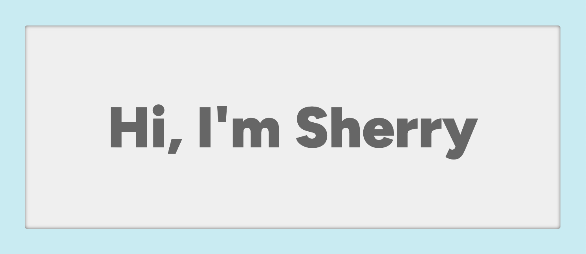

### All About Me

- I'm a developer whose interests lie in front-end and full-stack web development.
- I have a background in education and linguistics. In these areas as well as in programming, I'm all about using research and systems thinking to piece together puzzles and solve problems.
- I'm currently working on [an educational course-hosting website](https://github.com/xsherryhe/matter-of-course).
- I'm **actively looking to collaborate**! [Get in touch](mailto:xsherryhe.dev@gmail.com) if you:
  - Are looking for contributors for your project
  - Have an idea, suggestion, or bug fix for one of my projects
- [📘 Check out my portfolio](https://xsherryhe.github.io/)

## Contact Me

  
  
  

<!-- red icons>

## Projects

<!-- blue icons >

## Technology Stack

<!-- blue or red icons >

<!--
**xsherryhe/xsherryhe** is a ✨ _special_ ✨ repository because its `README.md` (this file) appears on your GitHub profile.

Here are some ideas to get you started:

- 🔭 I’m currently working on ...
- 🌱 I’m currently learning ...
- 👯 I’m looking to collaborate on ...
- 🤔 I’m looking for help with ...
- 💬 Ask me about ...
- 📫 How to reach me: ...
- 😄 Pronouns: ...
- ⚡ Fun fact: ...
-->
