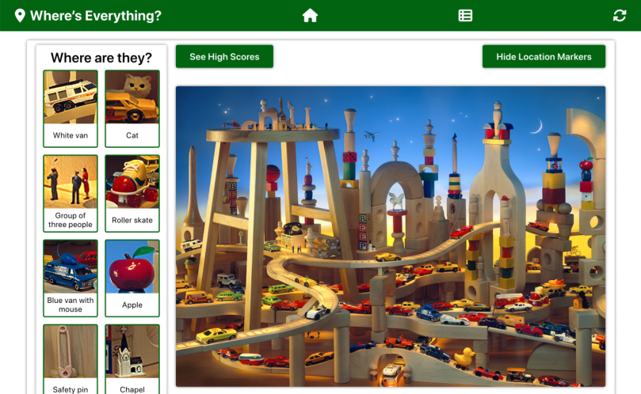

### All About Me

- I'm a developer whose interests lie in front-end and full-stack web development.
- I have a background in education and linguistics. In these areas as well as in programming, I'm all about using research and systems thinking to piece together puzzles and solve problems.
- Projects that I'm currently working on:
  - [An educational course-hosting website](https://github.com/xsherryhe/matter-of-course)
  - [A smart thesaurus app](https://github.com/xsherryhe/smart-synonyms)
- I'm **actively looking to collaborate**! [Get in touch](mailto:xsherryhe.dev@gmail.com) if you:
  - Are looking for contributors for your project
  - Have an idea, suggestion, or bug fix for one of my projects
- [📘 Check out my portfolio](https://xsherryhe.github.io/)

## Contact Me

  
  
  

## Projects

<table>
  <tr>
    <td width="50%">
      <h3 align="center">Clonebook</h3>
      
       
       
      

        
        
        
<strong>Ruby on Rails, Stimulus.js, Turbo, CSS3, HTML5</strong>

        
A Facebook-like app, with core features such as profiles, friends, posts, likes, and comments.

      

    </td>
    <td width="50%">
      <h3 align="center">Where's Everything?</h3>
      
       
       
      

        
        
        
<strong>Ruby on Rails, React.js, CSS3, HTML5</strong>

        
A photo-tagging game app in the style of Where's Waldo. Includes multiple images and high scores.

      

    </td>
  </tr>
  <tr>
    <td width="50%">
      <h3 align="center">Weather App</h3>
      
       
       
      

        
        
        
<strong>JavaScript, Webpack, CSS3, HTML5</strong>

        
An app that displays weather forecasts for cities around the world, along with a weather-relevant GIF.

      

    </td>
    <td width="50%">
      <h3 align="center">Space Donuts</h3>
      
       
       
      

        
        
        
<strong>React.js, CSS3, HTML5</strong>

        
A space-themed memory game in which the player's goal is to never click the same donut card twice.

      

    </td>
  </tr>
  <tr>
    <td width="50%">
      <h3 align="center">Crepes on a Cloud</h3>
      
       
       
      

        
        
        
<strong>JavaScript, Webpack, CSS3, HTML5</strong>

        
A stylish info website for a restaurant, with tab-based browsing for menu and contact details.

      

    </td>
    <td width="50%">
      <h3 align="center">The BoardWalk Shopping App</h3>
      
       
       
      

        
        
        
<strong>React.js, Jest, React Testing Library, CSS3, HTML5</strong>

        
An online shopping app and cart for board games.

      

    </td>
  </tr>
</table>

## Technology Stack and Tools

  
  
  
  
  
  
  
  
  
  
  
  
  
  
  
  

 

  

<!--
**xsherryhe/xsherryhe** is a ✨ _special_ ✨ repository because its `README.md` (this file) appears on your GitHub profile.

Here are some ideas to get you started:

- 🔭 I’m currently working on ...
- 🌱 I’m currently learning ...
- 👯 I’m looking to collaborate on ...
- 🤔 I’m looking for help with ...
- 💬 Ask me about ...
- 📫 How to reach me: ...
- 😄 Pronouns: ...
- ⚡ Fun fact: ...
-->
